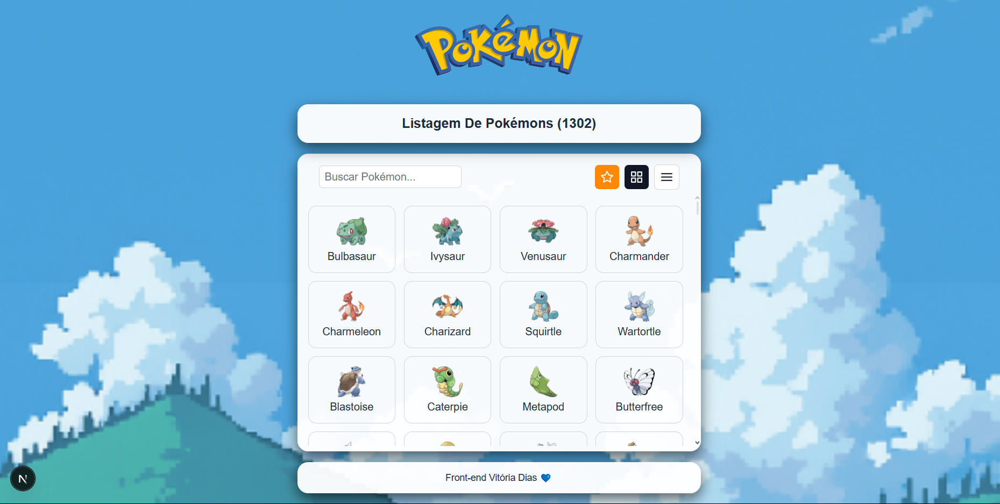

# Projeto Pokédex - Work Shop - Fábrica de Software 

 Uma Aplicação web desenvolvida em React e TypeScript para listar, buscar e favoritar Pokémons, exibindo suas imagens e nomes de forma simples e interativa.

## Tecnologias Utilizadas 

- React - Biblioteca para construção da interface.
- TypeScript - Tipagem estática.
- CSS/Styled Components/Tailwind - Estilização
- PokéAPI - Fonte de dados para os Pokémons.

## Funcionalidades
- Listagem de Pokémons da 1ª geração.
- Campo de busca para filtrar Pokémons por nome.
- Alternância entre  **grid** e **lista**.
- Design responsivo.
- Rodapé personalizado.

## Estrutura do Projeto

📂 pokemon-pokedex  
├── 📂 src  
│    ├── 📂 app  
│    ├── 📂 components   
│    ├── 📂 hooks 
│    ├── 📂 services 
│    ├── 📂 types 
│    └── page.tsx  
├── 📂 public    
├── 📄 package.json   
├── 📄 tsconfig.json   
├── 📄 next.config.ts  
├── 📄 postcss.config.mjs   
└── 📄 README.md      

## Como Rodar o Projeto 
- Clone o repositório 
- Acesse a pasta do projeto
**cd pokedex**
- Instale as dependências
**npm install # ou yarn install**
- Execute o projeto 
**npm run dev** # ou **yarn install**
- Acesse no navegador: https://localhost:3000

## Acesse a Pokédex
https://ws-frontend-fabrica25-2-xi.vercel.app

## Foto da Preview da tela inicial

## Aluna / Front-end 
- Vitória Dias, turma C - Ciência da Computação - P4
- -Se gostou, dê uma estrela no repositório<3